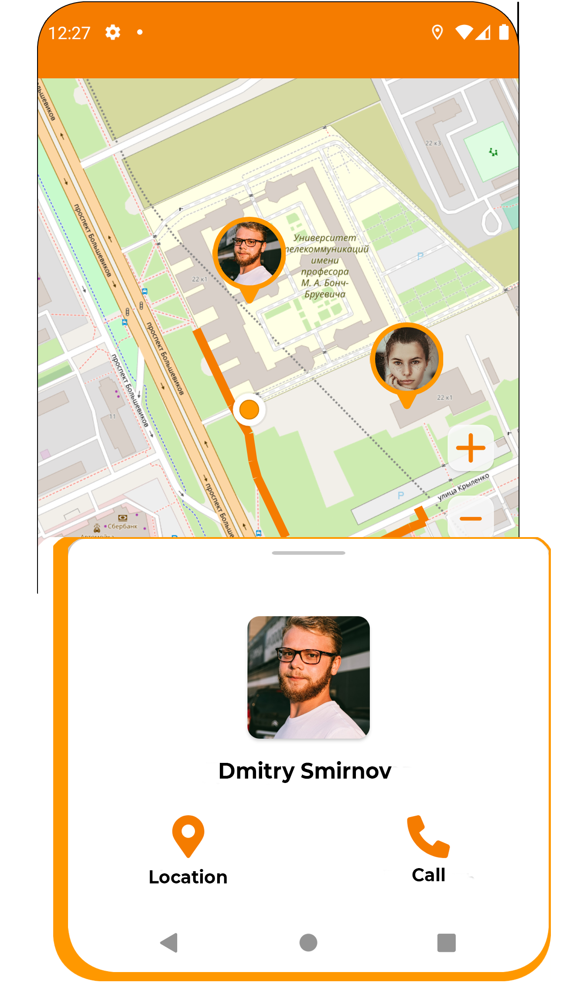

# Signals - application for sending SOS to people nearby
An android multi-module application with complex DI system based on Dagger2.

## Description
This application is more than just a pet project. I came up with the idea of delivering SOS signals to people nearby more than a year ago. In the fall of 2022 the number of certain types of crimes in Russia increased, and sociologists expected its further growth. So I understood that the time has come and I started designing the project that could save some people's lives.

Application API: [signals-api](https://github.com/Girrafeec/signals-api)

Application was not completed and the project was not launched because of the workload and some concept problems. The idea of project should be redesigned and its new version must be based on some technology but not just based on client-server system.

This application was also submitted as undergraduate thesis.

[Product presentation](docs/presentation/Signals_product_presentation.pdf)

[Tech presentation](docs/presentation/Signals_tech_presentation.pdf)

## User features
Unauthenticated user may:
* See onboarding slides
* Accept application permissions
* Login

Authenticated user may:
* Send SOS signal with SOS type selection and attaching comment with necessary information
* Cancel SOS if it was triggered accidentally
* See the list of rescuers after sending SOS
* See rescuers markers on map
* See rescuer details and make a phone call
* Call emergency services
* Cancel SOS signal
* See active signals on signals map
* See signal details and accept signal (turn on rescuer mode)

## Tech stack
DI, Async, Network, Push, Maps:
* [Dagger](https://github.com/google/dagger)
* [Kotlin Coroutines](https://github.com/Kotlin/kotlinx.coroutines)
* [OkHttp](https://github.com/square/okhttp)
* [Retrofit](https://github.com/square/retrofit)
* [Firebase Messaging](https://firebase.google.com/docs/cloud-messaging/android/client)
* [OSMDroid](https://github.com/osmdroid/osmdroid)
* [OSMDroid BonusPack](https://github.com/MKergall/osmbonuspack)

Jetpack:
* [Navigation Component](https://developer.android.com/guide/navigation/get-started)
* [ViewModel](https://developer.android.com/topic/libraries/architecture/viewmodel)
* [Room](https://developer.android.com/training/data-storage/room)

Extras:
* [SharedPreferencesMock](https://github.com/IvanShafran/shared-preferences-mock)
* [EazyPermissions](https://github.com/sagar-viradiya/eazypermissions)
* [CircleIndicator](https://github.com/ongakuer/CircleIndicator)

## Architecture

### Common
Application is built according to the principles of SOLID and [Сlean architecture](https://blog.cleancoder.com/uncle-bob/2012/08/13/the-clean-architecture.html). MVVM is used as a design pattern. MVI based on MVVM and Kotlin Coroutines [StateFlow](https://kotlinlang.org/api/kotlinx.coroutines/kotlinx-coroutines-core/kotlinx.coroutines.flow/-state-flow/) is partly implemented for most of the screens and some independent modules' engines (_e.g. [SignalsServiceImpl](https://github.com/Girrafeec/signals-app/blob/mvp-version/feature-signals-impl/src/main/java/com/girrafeecstud/signals/signals_impl/engine/SignalsEngineImpl.kt#L31), [SignalsEngineState](https://github.com/Girrafeec/signals-app/blob/mvp-version/feature-signals-api/src/main/java/com/girrafeecstud/signals/signals_api/engine/SignalsEngineState.kt)_).

Application separated into different modules according to "core"-"feature" separation. Most of "feature" modules are divided into "api" and "implementation" to create an opportunity for different "feature" modules to be dependent from other "feature" modules via some "API" without certain implementation (_more information may be found in the articles written by Evgenii Matsiuk: [Modularization in Android: architecture point of view. From A to Z. Part I](https://proandroiddev.com/modularization-in-android-architecture-point-of-view-from-a-to-z-part-i-7a86e6e03799) and [Modularization in Android: architecture point of view. From A to Z. Part II](https://proandroiddev.com/modularization-in-android-architecture-point-of-view-from-a-to-z-part-ii-8baea5b2e4fd)_).

### Modularization
All application modules are presented in the diagram:


#### Some modules description
[core-components](https://github.com/Girrafeec/signals-app/tree/mvp-version/core-components) module was mostly added to project for providing application Context to feature modules. This decision was made because many modules needed application Context and also other features provided by "api" modules, so it was not good to create manually implementation of some "implementation" module dependencies class in "app" module and override application Context there like it was made with core modules in [SignalsApp](https://github.com/Girrafeec/signals-app/blob/mvp-version/app/src/main/java/com/girrafeecstud/signals/app/SignalsApp.kt#L187) class.

[feature-on-board](https://github.com/Girrafeec/signals-app/tree/mvp-version/feature-on-board) module is used for user onboarding feature and requesting runtime permissions.

[feature-push-notifications-api](https://github.com/Girrafeec/signals-app/tree/mvp-version/feature-push-notifications-api) and [feature-push-notifications-impl](https://github.com/Girrafeec/signals-app/tree/mvp-version/feature-push-notifications-impl) modules are used for saving firebase unique messaging token and sending it to server side for providing push notifications in future.

[feature-signals-screens](https://github.com/Girrafeec/signals-app/tree/mvp-version/feature-signals-screens) module contains screens for configuring and sending SOS signals. It depends on [feature-countdown-timer-api](https://github.com/Girrafeec/signals-app/tree/mvp-version/feature-countdown-timer-api) and [feature-sos-signal-api](https://github.com/Girrafeec/signals-app/tree/mvp-version/feature-sos-signal-api) modules.

#### Multi-module screens
Except possible modules reuse and responsibility separation multi-module architecture was applied to application for drawing screens content by several independent modules. For example, [SosMapFragment](https://github.com/Girrafeec/signals-app/blob/mvp-version/feature-signals-map/src/main/java/com/girrafeecstud/signals/feature_map/ui/SosMapFragment.kt) displays rescuers list over map. Also rescuer details screen is shown to user over map if it clicks on the rescuers list item or on the rescuer marker on map.

 

Rescuers list fragment is added over map screen in [SosMapFragment OnViewCreated](https://github.com/Girrafeec/signals-app/blob/mvp-version/feature-signals-map/src/main/java/com/girrafeecstud/signals/feature_map/ui/SosMapFragment.kt#L153) lifecycle stage. Then [feature-rescuers-list-impl](https://github.com/Girrafeec/signals-app/tree/mvp-version/feature-rescuers-list-impl) module updates list by itself and informs map screen if some list element was clicked using [rescuers list shared engine](https://github.com/Girrafeec/signals-app/blob/mvp-version/feature-rescuers-list-api/src/main/java/com/girrafeecstud/signals/rescuers_list_api/presenation/RescuersListSharedStateEngine.kt) and [it's state observing](https://github.com/Girrafeec/signals-app/blob/mvp-version/feature-signals-map/src/main/java/com/girrafeecstud/signals/feature_map/ui/SosMapFragment.kt#L139) in [SosMapFragment](https://github.com/Girrafeec/signals-app/blob/mvp-version/feature-signals-map/src/main/java/com/girrafeecstud/signals/feature_map/ui/SosMapFragment.kt).

Rescuer details fragment is generated by [feature-rescuer-details-impl](https://github.com/Girrafeec/signals-app/tree/mvp-version/feature-rescuer-details-impl) module. When rescuer marker or rescuers list element is clicked map module just adds [BaseRescuerDetailsFragment](https://github.com/Girrafeec/signals-app/blob/mvp-version/feature-rescuer-details-api/src/main/java/com/girrafeecstud/signals/rescuer_details_api/ui/BaseRescuerDetailsFragment.kt) to container and sets [BottomSheedBehavior](https://developer.android.com/reference/com/google/android/material/bottomsheet/BottomSheetBehavior) for new fragment.
**There is a bug with rescuer details fragment. When application is collapsed or new Activity is opened** (_e.g. when user clicks "Call" button on rescuer details screen and phone call Activity is opened_) **application does not remove details fragment from its container and then breaks if user tries to open details fragment again.**

#### Engines and states
Most of app modules are developed to be independent from each other or to be reused in future projects. Engines classes were designed to access some modules' features from other modules. Typically, dependent module knows about engine's interface from "api" version of dependency module. Firstly engines were made just for sending some commands to modules (_e.g. [LocationTrackerEngine](https://github.com/Girrafeec/signals-app/blob/mvp-version/feature-location-tracker-api/src/main/java/com/girrafeecstud/location_tracker_api/engine/LocationTrackerEngine.kt)_), but then most of engines were updated for getting data about module state (_e.g. [SosSignalEngine](https://github.com/Girrafeec/signals-app/blob/mvp-version/feature-sos-signal-api/src/main/java/com/girrafeecstud/sos_signal_api/engine/SosSignalEngine.kt)_). It was better just to observe some module state than to use global event bus that was added to project for getting info about sos signal state (_[AppEvent](https://github.com/Girrafeec/signals-app/blob/mvp-version/event-bus/src/main/java/com/girrafeecstud/signals/event_bus/AppEvent.kt)_) but then thrown away because of potential danger of rising the number of events in the bus. Now, [event-bus](https://github.com/Girrafeec/signals-app/tree/mvp-version/event-bus) module is not used.

As mentioned earlier, most of modules has it's state of lifecycle. It allows dependent modules to receive some data (_e.g. [CountDownTimerState](https://github.com/Girrafeec/signals-app/blob/mvp-version/feature-countdown-timer-api/src/main/java/com/girrafeecstud/countdown_timer_api/engine/CountDownTimerState.kt) contains countdown timer states and also milliseconds data_) or just to observe some module lifecycle for choosing what action to do next. 

Here is an example of [feature-sos-signal-api](https://github.com/Girrafeec/signals-app/tree/mvp-version/feature-sos-signal-api) module lifecycle:


By default, the signal is in the "DISABLED" state, but when the emergency signal engine is triggered by user the signal goes into the ["PREPARING"](https://github.com/Girrafeec/signals-app/blob/mvp-version/feature-sos-signal-impl/src/main/java/com/girrafeecstud/sos_signal_impl/service/SosSignalService.kt#L168) state, during which the signal triggers a notification and a countdown timer until the signal is sent to server. After [the end of the countdown](https://github.com/Girrafeec/signals-app/blob/mvp-version/feature-sos-signal-impl/src/main/java/com/girrafeecstud/sos_signal_impl/service/SosSignalService.kt#L158), if the user has not canceled the launch, the signal goes into the ["SENDING"](https://github.com/Girrafeec/signals-app/blob/mvp-version/feature-sos-signal-impl/src/main/java/com/girrafeecstud/sos_signal_impl/service/SosSignalService.kt#L179) state and attempts to deliver the signal to the server. If the signal is delivered and a response with "201 Created" status is received from the server, then the signal goes into the ["SUCCESS"](https://github.com/Girrafeec/signals-app/blob/mvp-version/feature-sos-signal-impl/src/main/java/com/girrafeecstud/sos_signal_impl/service/SosSignalService.kt#L186) state, otherwise it goes into the "ERROR" state. **In the second case app must wait till network connection will be established and then retry sending signal, but now this feature is not implemented.**

When user disables signal it goes to the "DISABLING" state and after successful response from the server it returns to the "DISABLED" state.

### Navigation
Application is designed according to SingleActivity architecture. That's why screens are divided into 2 groups: flow fragments and regular fragments.

Flow fragments are located in different feature modules. It was the main reason to design separate [navigation](https://github.com/Girrafeec/signals-app/tree/mvp-version/navigation) module that contains base interfaces for navigation like [Navigator](https://github.com/Girrafeec/signals-app/blob/mvp-version/navigation/src/main/java/com/girrafeecstud/signals/navigation/Navigator.kt) or [NavigationDestination](https://github.com/Girrafeec/signals-app/blob/mvp-version/navigation/src/main/java/com/girrafeecstud/signals/navigation/destination/NavigationDestination.kt) and it implementations for root navigation between flow fragments (_e.g. [FlowNavigator](https://github.com/Girrafeec/signals-app/blob/mvp-version/navigation/src/main/java/com/girrafeecstud/signals/navigation/FlowNavigator.kt) and [FlowDestination](https://github.com/Girrafeec/signals-app/blob/mvp-version/navigation/src/main/java/com/girrafeecstud/signals/navigation/destination/FlowDestination.kt)_).

Navigation interfaces are also implemented in some feature modules (_e.g. [feature-signals-map](https://github.com/Girrafeec/signals-app/tree/mvp-version/feature-signals-map/src/main/java/com/girrafeecstud/signals/feature_map/navigation)_) for providing navigation rules between fragments inside flow fragments. Flow fragments choose its start destination based on screen value [taken from navigation args](https://github.com/Girrafeec/signals-app/blob/mvp-version/feature-signals-map/src/main/java/com/girrafeecstud/signals/feature_map/ui/MapsFlowFragment.kt#L92) every time it is opened.

Start destination selection:


Application navigation graph:


Some navigation classes were partly redesigned in [example-file-manager](https://github.com/Girrafeec/example-file-manager/tree/main/navigation/src/main/java/com/girrafeecstud/navigation) project.

## Extra features
### Custom markers
OSMDroid does not provide standard classes for adding overlays with photo to map.

Custom layouts were created for using markers with custom shape and ImageView inside it.

[SOS signal marker](https://github.com/Girrafeec/signals-app/blob/mvp-version/feature-signals-map/src/main/res/layout/sos_signal_marker.xml) layout code:
```
<?xml version="1.0" encoding="utf-8"?>
<androidx.constraintlayout.widget.ConstraintLayout xmlns:android="http://schemas.android.com/apk/res/android"
    android:layout_width="wrap_content"
    android:layout_height="wrap_content"
    xmlns:app="http://schemas.android.com/apk/res-auto"
    android:elevation="2dp">

    <FrameLayout
        android:layout_width="wrap_content"
        android:layout_height="wrap_content"
        android:id="@+id/pin_container"
        app:layout_constraintTop_toTopOf="parent"
        app:layout_constraintBottom_toBottomOf="parent"
        app:layout_constraintStart_toStartOf="parent"
        app:layout_constraintEnd_toEndOf="parent">

        <ImageView
            android:layout_width="wrap_content"
            android:layout_height="wrap_content"
            android:layout_marginTop="50dp"
            android:layout_gravity="center|bottom"
            android:src="@drawable/red_reversed_triangle"/>

    </FrameLayout>

    <FrameLayout
        android:layout_width="60dp"
        android:layout_height="60dp"
        android:id="@+id/signal_sender_image_container"
        android:padding="4dp"
        android:background="@drawable/red_regular_circle"
        app:layout_constraintTop_toTopOf="parent"
        app:layout_constraintStart_toStartOf="parent"
        app:layout_constraintEnd_toEndOf="parent">

        <com.girrafeecstud.core_ui.view.RoundedImageView
            android:layout_width="match_parent"
            android:layout_height="match_parent"
            android:id="@+id/signal_sender_image"
            android:scaleType="centerCrop"
            android:src="@drawable/ic_launcher_background"/>

    </FrameLayout>

</androidx.constraintlayout.widget.ConstraintLayout>
```
Marker appearance:


### Location tracker features
There are some features in [feature-location-tracker-impl](https://github.com/Girrafeec/signals-app/tree/mvp-version/feature-location-tracker-impl) module added for decreasing number of network requests and map's objects updates.

Firstly, after getting location data from [LocationTrackerClient](https://github.com/Girrafeec/signals-app/blob/mvp-version/feature-location-tracker-impl/src/main/java/com/girrafeecstud/signals/location_tracker_impl/data/DefaultLocationTrackerClient.kt) [LocationTrackerDataSource](https://github.com/Girrafeec/signals-app/blob/mvp-version/feature-location-tracker-impl/src/main/java/com/girrafeecstud/signals/location_tracker_impl/data/datasource/LocationTrackerDataSource.kt) checks if location is not the same as last received and emits it to repository only if it differs.

Flow extension for emitting unique location data:
```
internal fun Flow<Location>.uniqueLocation(): Flow<Location> =
    flow {
        var lastLocation: Location? = null
        collect { location ->
            if (
                lastLocation?.latitude != location.latitude ||
                        lastLocation?.longitude != location.longitude
            ) {
                lastLocation = location
                emit(location)
            }
        }
    }
```

Then, [LocationTrackerRepository](https://github.com/Girrafeec/signals-app/blob/mvp-version/feature-location-tracker-impl/src/main/java/com/girrafeecstud/signals/location_tracker_impl/data/repository/LocationTrackerRepositoryImpl.kt) compares received location with last sent location value taken from local memory and if the distance between 2 points is more than 5 meters (_it was changed to 10 meters because the number of HTTP-requests was too big and it could rise VPS monthly costs_) it calls [RemoteLocationTrackerDataSource](https://github.com/Girrafeec/signals-app/blob/mvp-version/feature-location-tracker-impl/src/main/java/com/girrafeecstud/signals/location_tracker_impl/data/datasource/RemoteLocationsDataSource.kt) for sending location update to the server.

The algorithm described before is shown in figure: 


## Screenshots

 

 

 

 

